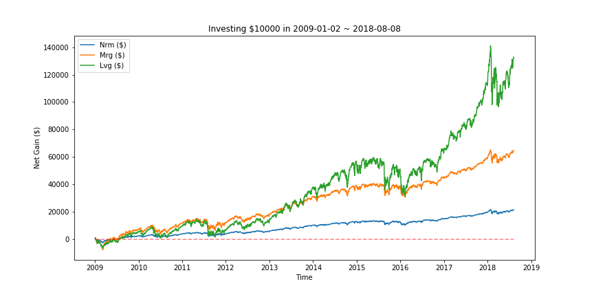
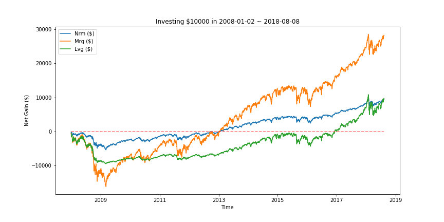

## Leveraged ETF

This code compares the performance of three investment strategies in exchange-traded fund (ETF). Historic data of S&P 500 index from January 4 2016 to August 9 2018 were collected to evaluate investment strategies within a specified range of time. The code offers the options to plot portfolio networth, percentage gain, net dollar gain, and cash-out dollar amount as a function of time.

1. Invest all fund in non-leveraged ETF.
   This strategy dutifully tracks S&P500 index with no margin or leverage. For $100 starting fund, a 10% rise in S&P500 index increases portfolio value to $110, a 10% percentage again, a net $10 dollar gain, and $110 cash-out dollar amount.
   
2. Invest all fund, with largest possible margin in non-leveraged ETF.
   This strategy buys non-leveraged ETF on margin. For $100 starting fund and 100% margin, a 10% rise in S&P500 index increases portfolio value to $220, a 20% percentage gain (on original starting fund), a net $20 dollar gain, and $120 cash-out dollar amount (after paying back the $100 borrowed on margin).
   
3. Invest in leveraged ETF.
   This strategy invests fully in leveraged ETF with no margin. For a $100 starting fund and 3 times leverage, a 10% rise in S&P500 index increases portfolio value to $120, a 20% percentage gain, a net $20 dollar gain, and $120 cash-out dollar amount.
   
The main difference in calculating strategies 2 and 3 is that strategy 2 follows the same percentage gain as strategy 1, and pays back the borrowed amount at cash-out. Strategy 3 follows leverage * percentage fluctuation. 

## Evaluation
THe three strategies were compared on the basis of $10,000 starting fund, a 3 times leverage and a 200% margin. Two different entry time yielded completely different outcomes. 

Starting in 2009 immediately after the financial meltdown, S&P 500 consistently rose, whose percentage gain was magnified by the leveraged ETF. By 2018, leveraged ETF has delivered a $120,000 net dollar gain.

If the time window starts one year earlier, then leveraged ETF delivered the worst performance among the three. Strategies 1 and 2 recovered loss at around 2013, whereas strategy 3 failed to recover until 2017.
